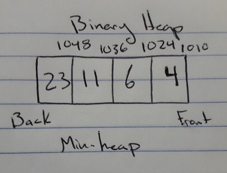

# Binary Heap

A binary heap is a common way to tackle the issue of creating a priority queue. The binary heap has two variations: min heap, where the smallest key is always at the front of the queue, and max heap with the largest key is at the front.

# In Memory

In memory, a binary heap looks like this:



# Operations

A binary heap supports the following operations:

* Insertion: Inserts a new element into the binary heap and percolates up if necessary, O(1), The element is inserted to the bottom of the heap, and is then checked against it's parent, if it is smaller/larger depending on what kind of heap is being used, it percolates up. Since the act of swapping is O(1), heaps insertion complexity depends on the required levels that must be percolated up.
* Deletion: Removes an element from the heap and percolates down if necessary, O(logn), If the root is removed from the heap, the replacement comes from the last element of the last level. Therefore, if another element is larger/smaller depending on min/max heaps, it must be percolated.

# Use Cases

A binary heap is useful when you wish to maintain a priority queue of elements, using the weight of their value to correspond to their place in line, like a person with a broken thumb being lower priority than someone who has a missing thumb. The ability to update the queue is a massive advantage if new nodes are being inserted regularly.

It is not as good as a singly/doubly linked list if you wish to maintain a constant time for inserting or deleting elements after they've surpassed their use.

# Example

```
bh = BinaryHeap()
bh.insert(4)
bh.insert(3)
bh.insert(10)
bh.del_min()
bh.insert(1)
print(bh)
```

[Previous](avl_tree.md) [Next](graph.md)

(c) 2018 AUSTIN HENDRICKS. All rights reserved.
