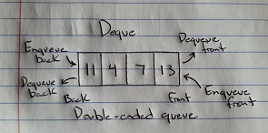

# Deque

A deque, also known as a, "double-ended queue" is an ordered collection of items much like a queue. The difference between the two is that a deque has no restriction on which end items are added or removed.

# In Memory

In memory, a deque looks like this:



# Operations

A deque supports the following operations:

* Search: Traverses through the deque from the front or rear to return a boolean value, O(n), The deque must traverse through the deque, and since we don't know the exact location of the element, we are working with O(n) complexity much like a queue.
* Access/Insertion/Deletion: Dequeues off each element until it reaches the desired element/Enqueues a new element to the deque from either front or rear depending on which is specified/Dequeues an element from the front or rear depending on which is specified, O(1), Accessing remains in constant time because we simply must dequeue elements until we reach the desired element in the deque. Inserting and deleting is simply enqueuing and dequeuing elements like you would on queue. Therefore, we are always in constant time, even in the worst case.

# Use Cases

A deque is useful when you want to create an ordered list of numbers, or you can use a deque to check a string to see if the sequence of items is the same both ways, passing a palindrome test.

It is not as good as queue if you wish to maintain an ordered collection of items that are dealt with according to who showed up first.

# Example

```
d = Deque()
d.addRear(4)
d.addRear("Dog")
d.addFront(3.4)
print(d)
d.removeRear()
d.removeFront()
print(d)
```

[Previous](queue.md) [Next](tuple.md)

(c) 2018 AUSTIN HENDRICKS. All rights reserved.
