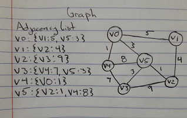

# Graph

A graph is a non-linear structure that consists of vertices (nodes) and edges or "arcs" that connect two vertices. Each edge has a weight that shows the cost of traversing from one vertex to another. Some graphs have all one-way edges, which are known as digraphs. Also, other graphs are acylic, which means you can start and end at the same vertex. Finally, directed acyclic graphs (DAG) is a directed graph with no available cycles.

# In Memory

In memory, a graph looks like this:



# Operations

A graph supports the following operations:

* Access/Search: description, Big O efficiency, and explain why / what that means
* Insertion/Deletion: description, Big O efficiency, and explain why / what that means

# Use Cases

A graph is useful when you wish to have the ability to traverse different paths to different vertices depending on the start and end point. Using an adjacency list allows us to take advantage of minimal cost paths for certain situations.

It is not as good as an AVL tree if you wish to have access/search time of O(logn) whereas graphs are dependent on number of vertices and edges O(|V|+|E|).

# Example

```
g = graph()
g.v0{v1:5, v3:4}
g.v1{v2:4, v3:5}
g.v2{v0:1}
g.v3{v1:4}
```

[Previous](binary_heap.md)

(c) 2018 AUSTIN HENDRICKS. All rights reserved.
