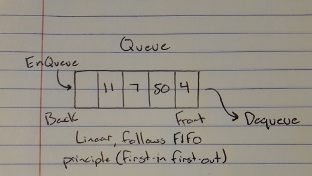

# Queues

A queue is a linear, ordered collection of items that follow the FIFO (first-in first-out) principle.

# In Memory

In memory, a queue looks like this:



\[description of diagram\]

# Operations

A queue supports the following operations:

* Access/Search: Returns a specific element in the queue by dequeuing until desired element is found/Traverses through the queue to return a boolean value, O(n), Since we cannot know how long the queue is, we must dequeue elements until we reach a specific element, and all other elements in the queue must shift, giving us a complexity of O(n).
* Insertion/Deletion: Queues a new element to the rear of the queue/Dequeues the element at the front of the queue, O(1), Inserting or deleting from a queue is as simple as enqueuing a new element at the rear, or dequeuing the element at the front which is a constant.

# Use Cases

A queue is useful when order and position must be known. If you've got a room of students who must each print a paper, having a queue will allow the printer to know who pushed the print button first/last, and print those papers accordingly.

It is not as good as deque because it does not allow items to be added to the front if priority for a particular item is enacted.

# Example

```
q = Queue()
q.enqueue(4)
q.enqueue("Dog")
q.enqueue(3.5)
print(q)
q.dequeue
print(q)
```

[Previous](array.md) [Next](deque.md)

(c) 2018 AUSTIN HENDRICKS. All rights reserved.
