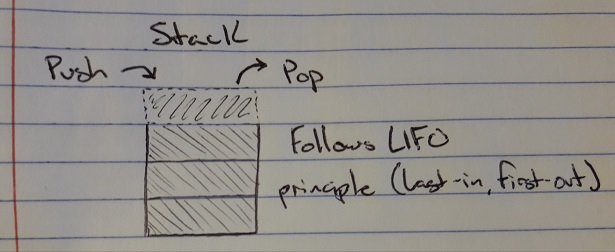

# Stacks

A stack is an ordered collection of items where the addition and removal of items always takes place on the same end. The ordering is often referred to as LIFO, last-in first-out.

# In Memory

In memory, a stack looks like this:



\[description of diagram\]

# Operations

A stack supports the following operations:

* Push: Adds a new item to the top of the stack, O(1), with a stack being a linear structure, adding a new item is constant, much like stacking a plate of dishes.
* Pop: Removes the top item from the stack, O(1), again with the LIFO ordering, removing an item is as simple as looking to the top of the stack for the item that will be removed.

# Use Cases

A stack is useful if you want an ordered list with a constant push/pop time complexity.

It is not as good as a queue if you want to access anything other than the data at the top of the stack. With a queue you are able to keep the data moving and reduces complexity because it follows FIFO ordering.

# Example

```
s = Stack()
s.push("dog")
s.push(4)
s.push(5.6)
print(s)
s.pop()
print(s)
s.peek()
```

[Previous](hash_table.md) [Next](array.md)

(c) 2018 AUSTIN HENDRICKS. All rights reserved.
