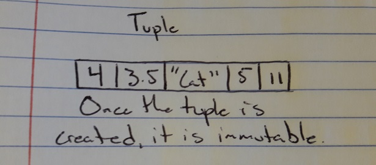

# Tuples

A tuple is a heterogeneous, ordered immutable collection of data, identified in Python with parenthesis ().

# In Memory

In memory, a tuple looks like this:



# Operations

A tuple supports the following operations:

* Index: Traverses through tuple to see if a piece of data is present, if it is returns the index, O(1), When the tuple is instantiated as an immutable collection of data, it allocates enough room for the objects and nothing more, so we can index in constant time since we know the size.
* Slicing: Slices a section of the tuple to a specified size, O(1), Much like indexing, since we already know the allocated size of the tuple, we have constant access to each element, we can slice the desired section in O(1) time.

# Use Cases

A tuple is useful if you want to create a collection of data that will not be altered in any aspect for its existence.

It is not as good as a dictionary, because while you can still access a piece of data in constant time, you are unable to add or remove items if they ever become irrelevant.

# Example

```
my_tuple = (4.5, "dog", 4, False)
print(my_tuple[1])
print(len(my_tuple))
print(my_tuple[1:3])
```

[Previous](deque.md) [Next](linked_list.md)

(c) 2018 AUSTIN HENDRICKS. All rights reserved.
